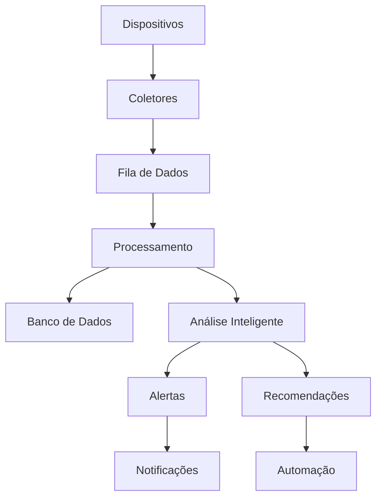
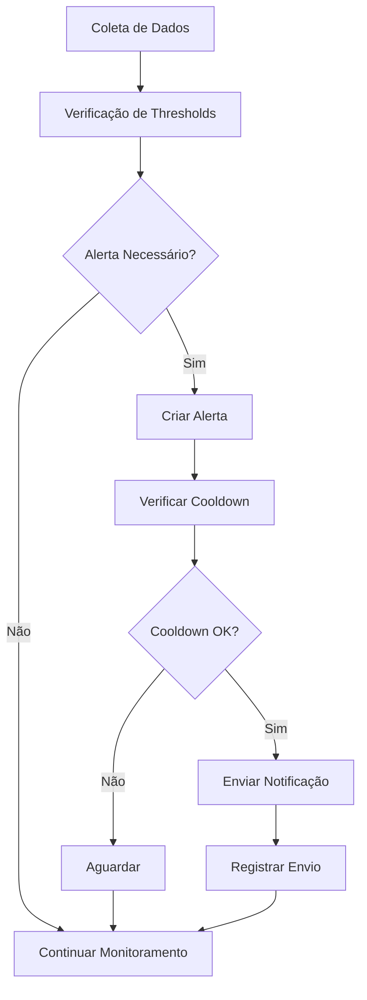
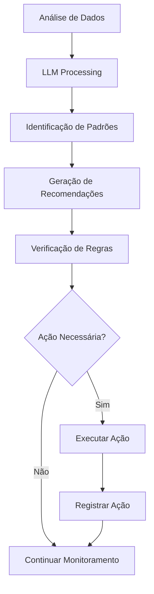

# Arquitetura Técnica - Sistema de Automação para Mineração de Bitcoin

## Visão Geral

Este documento descreve a arquitetura técnica completa do sistema de automação para mineração de Bitcoin, incluindo componentes, fluxos de dados, integrações e considerações de implementação.

## Arquitetura do Sistema

### Diagrama de Alto Nível

```
┌─────────────────────────────────────────────────────────────────┐
│                    SISTEMA DE AUTOMAÇÃO                        │
│                    MINERAÇÃO BITCOIN                           │
└─────────────────────────────────────────────────────────────────┘
                                │
                                ▼
┌─────────────────────────────────────────────────────────────────┐
│                    CAMADA DE APRESENTAÇÃO                      │
├─────────────────┬─────────────────┬─────────────────────────────┤
│   Dashboard     │   Mobile App    │      API REST               │
│     Web         │   (React Native)│     (FastAPI)               │
└─────────────────┴─────────────────┴─────────────────────────────┘
                                │
                                ▼
┌─────────────────────────────────────────────────────────────────┐
│                    CAMADA DE APLICAÇÃO                         │
├─────────────────┬─────────────────┬─────────────────────────────┤
│  Gerenciador    │   Analisador    │   Controlador de            │
│   do Sistema    │   Inteligente   │   Automação                 │
│                 │     (LLM)       │                             │
└─────────────────┴─────────────────┴─────────────────────────────┘
                                │
                                ▼
┌─────────────────────────────────────────────────────────────────┐
│                    CAMADA DE DADOS                             │
├─────────────────┬─────────────────┬─────────────────────────────┤
│   Coletores     │   Processadores │      Persistência           │
│   de Dados      │   de Dados      │      (PostgreSQL)           │
└─────────────────┴─────────────────┴─────────────────────────────┘
                                │
                                ▼
┌─────────────────────────────────────────────────────────────────┐
│                    CAMADA DE INFRAESTRUTURA                    │
├─────────────────┬─────────────────┬─────────────────────────────┤
│   Dispositivos  │   Sensores      │      Redes                  │
│   (ASICs, ABB)  │   (BLE, Temp)   │      (Modbus, HTTP)         │
└─────────────────┴─────────────────┴─────────────────────────────┘
```

## Componentes Principais

### 1. Backend (Python/FastAPI)

#### Estrutura de Módulos

```
backend/
├── core/
│   ├── config.py              # Configuração central
│   ├── system_manager.py      # Gerenciador principal
│   ├── data_collectors/       # Coletores de dados
│   │   ├── abb_collector.py   # Inversor ABB
│   │   ├── ble_collector.py   # Sensores BLE
│   │   ├── asic_collector.py  # ASICs
│   │   └── pool_collector.py  # Pools de mineração
│   ├── device_managers/       # Gerenciadores de dispositivos
│   │   └── asic_manager.py    # Gerenciador de ASICs
│   ├── analytics/             # Análise e ML
│   │   └── intelligent_analyzer.py  # Analisador com LLM
│   ├── automation/            # Controle automático
│   │   └── automation_controller.py  # Controlador de automação
│   ├── persistence/           # Persistência de dados
│   │   └── database.py        # Gerenciador de banco
│   ├── notifications/         # Sistema de notificações
│   │   └── notification_manager.py  # Gerenciador de alertas
│   └── websocket.py           # Comunicação em tempo real
├── api/
│   └── routes.py              # Rotas da API REST
└── main.py                    # Ponto de entrada
```

#### Tecnologias Utilizadas

- **FastAPI**: Framework web moderno e rápido
- **SQLAlchemy**: ORM para banco de dados
- **Pydantic**: Validação de dados
- **asyncio**: Programação assíncrona
- **pymodbus**: Comunicação Modbus
- **httpx**: Cliente HTTP assíncrono
- **tenacity**: Retry e backoff
- **prometheus-client**: Métricas de monitoramento

### 2. Banco de Dados (PostgreSQL)

#### Esquema de Dados

```sql
-- Tabelas principais
CREATE TABLE abb_readings (
    id UUID PRIMARY KEY,
    timestamp TIMESTAMP NOT NULL,
    device_id VARCHAR(100) NOT NULL,
    voltage FLOAT,
    current FLOAT,
    power FLOAT,
    frequency FLOAT,
    energy FLOAT,
    connected BOOLEAN DEFAULT TRUE,
    error_message TEXT,
    raw_data JSONB
);

CREATE TABLE asic_readings (
    id UUID PRIMARY KEY,
    timestamp TIMESTAMP NOT NULL,
    miner_id VARCHAR(100) NOT NULL,
    ip_address INET,
    model VARCHAR(100),
    status VARCHAR(50),
    hashrate FLOAT,
    power FLOAT,
    temperature FLOAT,
    fan_speed INTEGER,
    uptime INTEGER,
    errors INTEGER,
    efficiency FLOAT,
    connected BOOLEAN DEFAULT TRUE,
    error_message TEXT,
    raw_data JSONB
);

CREATE TABLE alerts (
    id UUID PRIMARY KEY,
    timestamp TIMESTAMP NOT NULL,
    alert_type VARCHAR(100) NOT NULL,
    severity VARCHAR(20) NOT NULL,
    message TEXT NOT NULL,
    device_id VARCHAR(100),
    data JSONB,
    resolved BOOLEAN DEFAULT FALSE,
    resolved_at TIMESTAMP,
    resolved_by VARCHAR(100)
);
```

### 3. Sistema de Monitoramento

#### Prometheus + Grafana

- **Prometheus**: Coleta de métricas
- **Grafana**: Visualização e dashboards
- **AlertManager**: Gerenciamento de alertas
- **Node Exporter**: Métricas do sistema
- **cAdvisor**: Métricas de containers

#### Métricas Principais

```yaml
# Exemplo de métricas coletadas
bitcoin_mining_hashrate_total{miner_id="miner_01"} 10.5
bitcoin_mining_temperature_celsius{miner_id="miner_01"} 65.0
bitcoin_mining_power_watts{miner_id="miner_01"} 1000.0
bitcoin_mining_efficiency_th_per_watt{miner_id="miner_01"} 0.0105
bitcoin_mining_uptime_seconds{miner_id="miner_01"} 86400
```

### 4. Sistema de Notificações

#### Canais Suportados

- **Email**: SMTP (Gmail, Outlook, etc.)
- **WhatsApp**: Business API
- **Telegram**: Bot API
- **SMS**: Twilio
- **Webhook**: Integrações customizadas

#### Estrutura de Alertas

```python
@dataclass
class Alert:
    id: str
    type: str
    severity: AlertSeverity
    message: str
    timestamp: datetime
    data: Dict[str, Any]
    channels: List[NotificationChannel]
    sent: bool = False
    retry_count: int = 0
```

### 5. Sistema de Automação

#### Regras de Automação

```python
# Exemplo de regra de automação
AutomationRule(
    name="temperatura_critica",
    condition="temperature > temp_critical",
    action=AutomationAction.SLEEP_ASICS,
    parameters={"reason": "Temperatura crítica detectada"},
    cooldown=600  # 10 minutos
)
```

#### Ações Disponíveis

- **SLEEP_ASICS**: Colocar ASICs em modo sleep
- **RESUME_ASICS**: Retomar ASICs
- **INCREASE_FAN_SPEED**: Aumentar velocidade dos ventiladores
- **DECREASE_FAN_SPEED**: Diminuir velocidade dos ventiladores
- **ACTIVATE_COOLING**: Ativar sistema de refrigeração
- **DEACTIVATE_COOLING**: Desativar sistema de refrigeração
- **SEND_ALERT**: Enviar alerta
- **OPTIMIZE_SETTINGS**: Otimizar configurações

## Fluxos de Dados

### 1. Coleta de Dados



### 2. Processamento de Alertas



### 3. Automação Inteligente



## Integrações

### 1. Dispositivos Industriais

#### Modbus TCP/RTU
- **Inversores ABB**: Leitura de tensão, corrente, potência
- **Multimedidores**: Consumo de energia
- **Sensores**: Temperatura, umidade, pressão

#### Protocolo BLE
- **Sensores sem fio**: Temperatura, umidade
- **Beacons**: Localização de dispositivos
- **Wearables**: Monitoramento de operadores

### 2. ASICs de Mineração

#### HashCore Toolkit
- **Descoberta automática**: Encontrar mineradores na rede
- **Controle remoto**: Sleep, resume, restart
- **Monitoramento**: Status, hashrate, temperatura
- **Configuração**: Overclock, undervolt

#### APIs de Fabricantes
- **Bitmain**: Antminer S19, S19 Pro, S19j Pro
- **MicroBT**: Whatsminer M30S, M31S
- **Canaan**: AvalonMiner 1246

### 3. Pools de Mineração

#### F2Pool
- **API REST**: Status da pool, workers
- **WebSocket**: Dados em tempo real
- **Métricas**: Hashrate, shares, rejeições

#### Slush Pool
- **API REST**: Status dos workers
- **Métricas**: Eficiência, recompensas
- **Alertas**: Problemas de conectividade

### 4. Blockchain e Criptomoedas

#### APIs de Preços
- **CoinMarketCap**: Preços de criptomoedas
- **CoinGecko**: Dados de mercado
- **Binance**: Preços em tempo real

#### APIs de Energia
- **ANEEL**: Tarifas de energia elétrica
- **CCEE**: Preços de energia
- **Distribuidoras**: Tarifas regionais

## Considerações de Segurança

### 1. Autenticação e Autorização

- **JWT Tokens**: Autenticação stateless
- **OAuth2**: Integração com provedores externos
- **RBAC**: Controle de acesso baseado em roles
- **2FA**: Autenticação de dois fatores

### 2. Criptografia

- **TLS/SSL**: Comunicação segura
- **AES-256**: Criptografia de dados sensíveis
- **Hashing**: Senhas e tokens
- **Certificados**: Validação de identidade

### 3. Proteção de Dados

- **LGPD**: Conformidade com lei brasileira
- **GDPR**: Conformidade com lei europeia
- **Backup**: Criptografia de backups
- **Auditoria**: Logs de acesso e modificações

## Escalabilidade

### 1. Horizontal

- **Load Balancer**: Distribuição de carga
- **Microserviços**: Separação de responsabilidades
- **Kubernetes**: Orquestração de containers
- **Auto-scaling**: Escala automática baseada em demanda

### 2. Vertical

- **Otimização de Código**: Performance e memória
- **Cache**: Redis para dados frequentes
- **Indexação**: Otimização de consultas
- **Compressão**: Redução de tráfego de rede

## Monitoramento e Observabilidade

### 1. Métricas

- **Sistema**: CPU, memória, disco, rede
- **Aplicação**: Requisições, erros, latência
- **Negócio**: Hashrate, eficiência, ROI
- **Customizadas**: Métricas específicas do domínio

### 2. Logs

- **Estruturados**: JSON para fácil parsing
- **Centralizados**: ELK Stack ou similar
- **Rotacionados**: Controle de tamanho
- **Correlacionados**: Trace IDs para rastreamento

### 3. Traces

- **Distributed Tracing**: Rastreamento de requisições
- **Jaeger/Zipkin**: Visualização de traces
- **Performance**: Identificação de gargalos
- **Debugging**: Resolução de problemas

## Backup e Recuperação

### 1. Estratégia de Backup

- **Incremental**: Apenas mudanças
- **Completo**: Backup completo semanal
- **Diferencial**: Mudanças desde último completo
- **Contínuo**: Backup em tempo real

### 2. Recuperação

- **RTO**: Tempo de recuperação objetivo
- **RPO**: Ponto de recuperação objetivo
- **Testes**: Validação regular de backups
- **Documentação**: Procedimentos de recuperação

## Considerações de Performance

### 1. Otimizações

- **Async/Await**: Programação assíncrona
- **Connection Pooling**: Reutilização de conexões
- **Caching**: Redução de consultas ao banco
- **Batch Processing**: Processamento em lotes

### 2. Profiling

- **cProfile**: Análise de performance Python
- **Memory Profiler**: Análise de uso de memória
- **APM**: Application Performance Monitoring
- **Load Testing**: Testes de carga

## Considerações de Manutenção

### 1. CI/CD

- **GitHub Actions**: Automação de builds
- **Docker**: Containerização
- **Testing**: Testes automatizados
- **Deployment**: Deploy automático

### 2. Documentação

- **API Docs**: Swagger/OpenAPI
- **Code Docs**: Docstrings e comentários
- **Architecture**: Documentação técnica
- **Runbooks**: Procedimentos operacionais

## Considerações de Custos

### 1. Infraestrutura

- **Cloud**: AWS, Azure, GCP
- **On-premise**: Servidores próprios
- **Híbrido**: Combinação de cloud e on-premise
- **Edge**: Processamento local

### 2. Licenças

- **Open Source**: Uso gratuito
- **Comercial**: Licenças pagas
- **SaaS**: Serviços pagos
- **Custom**: Desenvolvimento próprio

## Roadmap de Implementação

### Fase 1: MVP (0-3 meses)
- [x] Estrutura base do projeto
- [x] Coletores de dados básicos
- [x] Integração com ASICs
- [x] Dashboard inicial
- [x] Sistema de alertas básico

### Fase 2: Funcionalidades Avançadas (3-6 meses)
- [ ] Análise com LLM
- [ ] Controle automático
- [ ] Integração com pools
- [ ] Alertas inteligentes
- [ ] Relatórios avançados

### Fase 3: Escalabilidade (6-9 meses)
- [ ] App mobile
- [ ] Integração blockchain
- [ ] Otimizações de performance
- [ ] Microserviços
- [ ] Kubernetes

### Fase 4: Enterprise (9-12 meses)
- [ ] Machine Learning avançado
- [ ] Integração com exchanges
- [ ] Análise preditiva
- [ ] Multi-tenant
- [ ] Compliance completo

## Conclusão

Esta arquitetura fornece uma base sólida para um sistema de automação completo para mineração de Bitcoin, com foco em:

- **Escalabilidade**: Suporte a crescimento futuro
- **Manutenibilidade**: Código limpo e bem documentado
- **Confiabilidade**: Sistema robusto e resiliente
- **Segurança**: Proteção de dados e comunicações
- **Performance**: Otimizado para alta disponibilidade
- **Observabilidade**: Monitoramento completo do sistema

O sistema é projetado para ser modular, permitindo implementação incremental e adaptação às necessidades específicas de cada operação de mineração.


